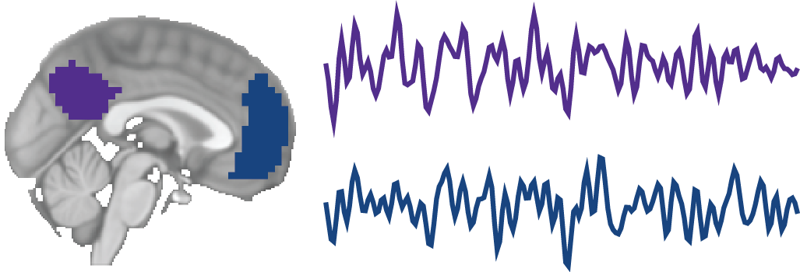

# nii-masker

<p align="center">
  
</p>

This is a simple command-line wrapper for `nilearn`'s [Masker objects](https://nilearn.github.io/manipulating_images/masker_objects.html) (hence the name), which let you easily extract out region-of-interest (ROI) timeseries from functional MRI data while providing several options for applying additional post-processing (e.g., spatial smoothing, temporal filtering, confound regression, etc). This tool ultimately aims to extend many of `nilearn`'s powerful and convenient masking features to non-Python users (e.g., R and MATLAB users) who wish to analyze fMRI data.

**Note:** This tool is undergoing rapid early development and is subject to bugs and potentially non-backwards compatible changes.

If you are using this project, please cite `nilearn`:

Abraham, A., Pedregosa, F., Eickenberg, M., Gervais, P., Mueller, A., Kossaifi, J., … Varoquaux, G. (2014). Machine learning for neuroimaging with scikit-learn. *Frontiers in Neuroinformatics*, *8*, 14.

[Link to paper](https://www.frontiersin.org/articles/10.3389/fninf.2014.00014/full). See also: [Nilearn documentation](https://nilearn.github.io/index.html).

# Documentation

## Installation

`niimasker` requires the following dependencies:

- numpy
- pandas
- nilearn>=0.5.0
- nibabel
- natsort
- jinja2
- load_confounds

First, download this repository to a directory. Then, navigate to the directory, `nii-masker/`, and run `pip install .` to install `niimasker`. To check your installation, run `niimasker -h` and you should see the help information.

## Using `niimasker`
`niimasker` is run via the command-line and can take the following arguments:

```
usage: niimasker [-h] [-i input_files [input_files ...]] [-r roi_file]
                 [-m mask_img] [--labels labels [labels ...]]
                 [--regressor_files regressor_files [regressor_files ...]]
                 [--denoising_strategy denoising_strategy [denoising_strategy ...]]
                 [--as_voxels] [--radius radius] [--allow_overlap]
                 [--standardize] [--t_r t_r] [--high_pass high_pass]
                 [--low_pass low_pass] [--detrend]
                 [--smoothing_fwhm smoothing_fwhm]
                 [--discard_scans discard_scans] [--n_jobs n_jobs] [-c config]
                 output_dir

positional arguments:
  output_dir            The path to the output directory

optional arguments:
  -h, --help            show this help message and exit
  -i input_files [input_files ...], --input_files input_files [input_files ...]
                        One or more input NIfTI images. Can also be a single
                        string with a wildcard (*) to specify all files
                        matching the file pattern. If so, these files are
                        naturally sorted by file name prior to extraction.
  -r roi_file, --roi_file roi_file
                        Parameter that defines the region(s) of interest. This
                        can be 1) a file path to NIfTI image that is an atlas
                        of multiple regions or a binary mask of one region, 2)
                        a nilearn query string formatted as `nilearn:<atlas-
                        name>:<atlas-parameters> (see online documentation),
                        or 3) a file path to a .tsv file that has x, y, z
                        columns that contain roi_file coordinates in MNI
                        space. Refer to online documentation for more on how
                        these options map onto the underlying nilearn masker
                        classes.
  -m mask_img, --mask_img mask_img
                        File path of a NIfTI mask image a to be used when
                        `roi_file` is a) an multi-region atlas or a b) list of
                        coordinates. This will restrict extraction to only
                        voxels within the mask. If `roi_file` is a single-
                        region binary mask, this will be ignored.
  --labels labels [labels ...]
                        Labels corresponding to the mask numbers in `mask`.
                        Can either be a list of strings, or a .tsv file that
                        contains a `Labels` column. Labels must be sorted in
                        ascending order to correctly correspond to the atlas
                        indices. The number of labels provided must match the
                        number of non-zero indices in `mask`. If none are
                        provided, numeric indices are used (default)
  --regressor_files regressor_files [regressor_files ...]
                        One or more tabular files with regressors in each
                        column. The number of files match the number of input
                        NIfTI files provided and must be in the same order.
                        The number of rows in each file must match the number
                        of timepoints in their respective input NIfTI files.
                        Can also be a single string with a wildcard (*) to
                        specify all files matching the file pattern. If so,
                        these files are naturally sorted by file name prior to
                        extraction. Double check to make sure these are
                        correctly aligned with the input NIfTI files.
  --denoising_strategy denoising_strategy [denoising_strategy ...]
                        The denoising strategy to use for confound
                        regression. Applies to all regressor files.
                        The denoising strategy must be either one predefined by
                        load_confounds or a list compatible with load_confounds flexible
                        denoising strategy options. See the documentation
                        https://github.com/SIMEXP/load_confounds. If no denoising strategy is provided,
                        but files are, all regressors in regressor files
                        are used.
  --as_voxels           Whether to extract out the timeseries of each voxel
                        instead of the mean timeseries. This is only available
                        for single ROI binary masks. Default False.
  --radius radius       Set the radius of the spheres (in mm) centered on the
                        coordinates provided in `roi_file`. Only applicable
                        when a coordinate .tsv file is passed to `roi_file`;
                        otherwise, this will be ignored. If not set, the
                        nilearn default of extracting from a single voxel (the
                        coordinates) will be used.
  --allow_overlap       Permit overlapping spheres when coordinates are
                        provided to `roi_file` and sphere-radius is not None.
  --standardize         Whether to standardize (z-score) each timeseries.
                        Default False
  --t_r t_r             The TR of the input NIfTI files, specified in seconds.
                        Must be included if temporal filtering or realignment
                        derivatives are specified.
  --high_pass high_pass
                        High pass filter cut off in Hertz. If it is not
                        specified, no filtering is done. (default)
  --low_pass low_pass   Low pass filter cut off in Hertz.
  --detrend             Whether to temporally detrend the data.
  --smoothing_fwhm smoothing_fwhm
                        Smoothing kernel FWHM (in mm) if spatial smoothing is
                        desired.
  --discard_scans discard_scans
                        Discard the first N scans of each functional NIfTI
                        image.
  --n_jobs n_jobs       The number of CPUs to use if parallelization is
                        desired. Default is 1 (serial processing).
  -c config, --config config
                        Configuration .json file as an alternative to command-
                        line arguments. See online documentation for what keys
                        to include.
```

Many of the parameters map directly onto the Masker function arguments in `nilearn` (see the [documentation](https://nilearn.github.io/modules/reference.html#module-nilearn.input_data) and [user guide](https://nilearn.github.io/building_blocks/manual_pipeline.html#masking) for more detail). Additionally, `--discard_scans` lets you remove the first *N* scans of your data prior to extraction, `--as_voxels` lets you get individual voxel timeseries when using a single ROI, and `--labels` lets you label your ROIs instead of just using the numerical indices. Furthermore, specifying `--n_jobs` parallelizes the extraction to reduce runtime.

Of course, if you want full `nilearn` flexibility, you're better off using `nilearn` and Python directly.

**Required parameters**
-  `ouput_dir`, specified by command-line only
- `input_files`, can be specified by the command-line or by a configuration file
- `roi_file`, can be specified by the command-line or by a configuration file

All other arguments are optional.

### Example

Say you want to extract the signals from two regions in an image (`img1.nii.gz`). Region masks are stored in `atlas.nii.gz`, and have the names "region1" and "region2". With this data, you want to regress out some confounds (e.g., motion realignent parameters, white matter signal, etc. stored in `confounds_for_img1.tsv`), detrend, high-pass filter, and finally standardize your data. The command to accomplish this is:

```bash
niimasker output/ -i img1.nii.gz -r atlas.nii.gz --labels region1 region2 \
--regressor_files confounds_for_img1.tsv --t_r 2 \
--high_pass 0.01 --detrend --standardize
```

The averaged BOLD timeseries for `region1` and `region2` are stored in `output/img1_timeseries.tsv`, which is a time x region table:

| region1 | region2 |
|---------|---------|
| .34950  | 1.20285 |
| .82030  | .92329  |
| 1.02455 | 1.51359 |
| .40925  | 1.39835 |
| -.02311 | .22324  |

To keep track over everything, a visual report is generated which shows the extracted timeseries, the region overlays on the averaged functional image, and all the parameters used in the pipeline.

## The configuration JSON file

Instead of passing all of the parameters through the command-line, `niimasker` also provides support for a simple configuration JSON file. The only parameter that needs to be passed into the command-line is the output directory (`output_dir`). All other parameters can either be set by the configuration file or by the command-line. **Note that the configuration file overwrites any of the command-line parameters**. An empty configuration file template of all of the parameters is provided in `config_template.json`, which is shown below:

```JSON
{
  "input_files": [],
  "roi_file": "",
  "mask_img": null,
  "labels": [],
  "regressor_files": null,
  "regressor_names": [],
  "denoising_strategy": [],
  "as_voxels": false,
  "sphere_size": null,
  "allow_overlap": false,
  "standardize": false,
  "t_r": null,
  "detrend": false,
  "high_pass": null,
  "low_pass": null,
  "smoothing_fwhm": null,
  "discard_scans": null,
  "n_jobs": 1
}
```

All parameter defaults are shown above. Not all parameters need to be included in the configuration file; only the ones you wish to use. An example use-case that combines both the command-line parameters and configuration file:

`niimasker output/ -i img_1.nii.gz img_2.nii.gz -c config.json`

Where `config.json` is:

```JSON
{
  "roi_file": "some_atlas.nii.gz",
  "standardize": true,
  "regressor_files": [
    "confounds1.tsv",
    "confounds2.tsv"
  ],
  "denoising_strategy": "Params6",
  "t_r": 2,
  "high_pass": 0.01,
  "smoothing_fwhm": 6
}
```

This set up is convenient when your `output_dir` and `input_files` vary on a subject-by-subject basis, but your post-processing and atlas might stay constant. Therefore, constants across subjects can be stored in the project's configuration file.

## The ROI file

The `roi_file` parameter (`-r` or `--roi_file`) can be a NIfTI image that is either a binary single region mask, or a multi-region atlas wherein each region is uniquely labeled using a numerical value. Or, it can also be a nilearn query string that fetches an atlas via nilearn. Lastly, `roi_file` can be a `.tsv` that contains a list of coordinates in the same space of the functional data (e.g., MNI coordinates). 

### Working with single ROI masks

`niimasker` lets you work with a binary mask such that non-zero values represent a single region of interest mask. Here, you can pass `--as_voxels` in the CLI or set `"as_voxels: true"` in your configuration file if you wish to extract the timeseries of every voxel within the region (otherwise the mean timeseries is extracted). This is useful for analyses such as ROI analysis or performing multivariate pattern analyses. A minimal example `config.json`:

```JSON
{
  "input_files": "img1.nii.gz",
  "roi_file": "motor_cortex.nii.gz",
  "as_voxels": true,
  "standardize": true,
  "t_r": 2,
  "detrend": true,
  "high_pass": 0.01,
}
```

Command:

`niimasker output/ -c config.json`

If you want to extract out voxelwise data for more than one region, you'll have to provide a new `roi_file` each time, and thus run `niimasker` separately for each ROI. Thanks to the configuration file, however, you can just change the command-line call, but keep the configuration file the same. For example, say you have two functional images (each with a TR=2) and you want to extract out two ROIs and perform some temporal filtering. Set the `config.json` to:

```JSON
{
  "input_files": ["img1.nii.gz", "img2.nii.gz"],
  "as_voxels": true,
  "standardize": true,
  "t_r": 2,
  "detrend": true,
  "high_pass": 0.01,
  "low_pass": null,
  "smoothing_fwhm": null,
}
```

Then, you can iteratively call niimasker using a for-loop (python example shown):

```python
import subprocess

rois = ['motor_cortex.nii.gz', 'premotor_cortex.nii.gz']

for mask in rois:
    roi_name = mask.split('.')[0] # remove file extension
    cmd = ('niimasker timeseries/{} -r {} -c config.json'.format(roi_name, mask))
    print(cmd)
    subprocess.run(cmd, shell=True)
```

Each iteration changes the ROI and output directory, but the configuration is the same for all ROIs.

### Working with an atlas

`niimasker` also lets you use an atlas that contains multiple regions, where voxels belonging to each region are labeled with numerical index. This is a typical functional connectivity use-case where you're interested in analyzing the relationships between the timeseries of multiple regions. A typical `config.json` for two functional images (TR=2), where you want to extract data from a 3-region atlas and perform some additional processing would be:

```JSON
{
  "input_files": ["img1.nii.gz", "img2.nii.gz"],
  "roi_file": "some_atlas.nii.gz",
  "labels": ["region1", "region2", "region2"],
  "regressor_files": [
    "confounds1.tsv",
    "confounds2.tsv"
  ],
  "denoising_strategy": "Params6",
  "standardize": true,
  "t_r": 2,
  "high_pass": 0.01,
  "detrend": true,
  "discard_scans": 4,
  "smoothing_fwhm": 6
}
```

Command:

`niimasker output/ -c config.json`

**Note:** When using an atlas, you can also pass a NIfTI image to `mask_img` (`--mask_img` or `-m`) to restrict atlas-extraction to specific voxels. A general example is using a subject specific whole-brain mask in order to exclude non-brain voxels from extraction. Or, you may only want the visual regions of your atlas and you can pass in an occipital lobe mask.

### Using atlases fetched by `nilearn`

`niimasker` also gives you the option to specify an atlas that is fetched directly by `nilearn` (a full list of datasets/atlases that can be fetched by `nilearn` can be found [here](https://nilearn.github.io/modules/reference.html#module-nilearn.datasets)). The following atlases are available:

| Atlas Name  | Parameter 1                                       | Parameter 2                       | Parameter 3 | `nilearn` function                                                                                                                                                                         |
|-------------|---------------------------------------------------|-----------------------------------|-------------|--------------------------------------------------------------------------------------------------------------------------------------------------------------------------------------------|
| `aal`       | `SPM5`, `SPM8`, `SPM12`                           | n/a                               | n/a         | [`fetch_atlas_aal`](https://nilearn.github.io/modules/generated/nilearn.datasets.fetch_atlas_aal.html#nilearn.datasets.fetch_atlas_aal)                                                    |
| `basc`      | `sym`, `asym`                                     | 7, 12, 20, 36, 122, 197, 325, 444 | n/a         | [`fetch_atlas_basc_multiscale_2015`](https://nilearn.github.io/modules/generated/nilearn.datasets.fetch_atlas_basc_multiscale_2015.html#nilearn.datasets.fetch_atlas_basc_multiscale_2015) |
| `destrieux` | `lateralized`, `nonlateralized`                   | n/a                               | n/a         | [`fetch_atlas_destrieux_2009`](https://nilearn.github.io/modules/generated/nilearn.datasets.fetch_atlas_destrieux_2009.html#nilearn.datasets.fetch_atlas_destrieux_2009)                   |
| `schaefer`  | 100, 200, 300, 400, 500, 600, 700, 800, 900, 1000 | 7, 17                             | 1, 2        | [`fetch_atlas_schaefer_2018`](https://nilearn.github.io/modules/generated/nilearn.datasets.fetch_atlas_schaefer_2018.html#nilearn.datasets.fetch_atlas_schaefer_2018)                      |
| `talairach` | `hemisphere`, `lobe`, `gyrus`, `tissue`, `ba`     | n/a                               | n/a         | [`fetch_atlas_talairach`](https://nilearn.github.io/modules/generated/nilearn.datasets.fetch_atlas_talairach.html#nilearn.datasets.fetch_atlas_talairach)                                  |
| `yeo`       | `thin_7`, `thick_7`, `thin_17`, `thick_17`         | n/a                               | n/a        | [`fetch_atlas_yeo_2011`](https://nilearn.github.io/modules/generated/nilearn.datasets.fetch_atlas_yeo_2011.html#nilearn.datasets.fetch_atlas_yeo_2011)                                     |

To fetch an atlas, `niimasker` takes a query string for `roi` in the following format: `nilearn:<atlas name>:<atlas-parameters>`. For instance, the Yeo atlas can be fetch as so: `nilearn:yeo:thick_7`

Subparameters in the `basc` and `schaefer` atlases are separated by hyphen. For instance, `nilearn:basc:sym-20` to fetch the Basc symmetrical 20-network atlas, and `nilearn:schaefer:400-17-2` to fetch the 400 region, 17-network atlas at 2mm spatial resolution.

Using the above example, we can replace the NIfTI atlas file with the following:

```JSON
{
  "input_files": ["img1.nii.gz", "img2.nii.gz"],
  "roi_file": "nilearn:schaefer:400-17-2",
  "labels": ["region1", "region2", "region2"],
  "regressor_files": [
    "confounds1.tsv",
    "confounds2.tsv"
  ],
  "denoising_strategy": "Params6",
  "standardize": true,
  "t_r": 2,
  "high_pass": 0.01,
  "detrend": true,
  "discard_scans": 4,
  "smoothing_fwhm": 6
}
```

### Working with a list of coordinates

A tab-delimited `.tsv` file containing coordinates can be passed into `roi_file`. These coordinates must be in the same space as the functional images (e.g., MNI). The file must contain three columns, and the first row should contain the column names, which must be: 'x', 'y', and 'z'. For instance:

| x   | y   | z   |
|-----|-----|-----|
| 50  | -20 | -42 |
| -38 | -27 | 69  |

`niimasker` will place a sphere centered around each coordinate, and extract the mean signal of each sphere. The radius of the spheres (in mm) is set using `radius` (`--radius`). If no radius is set, then only the signal from the coordinate voxel is extracted. By default, `niimasker` will raise an error if any of the spheres are overlapping, but you can allow the spheres to overlap by setting `allow_overlap: true` (or using `--allow_overlap`). An example configuration file is shown below: 

```JSON
{
  "input_files": ["img1.nii.gz", "img2.nii.gz"],
  "roi_file": "coordinates.tsv",
  "labels": ["region1", "region2"],
  "regressor_files": [
    "confounds1.tsv",
    "confounds2.tsv"
  ],
  "denoising_strategy": "Params6",
  "radius": 6,
  "allow_overlap": true,
  "standardize": true,
  "t_r": 2,
  "high_pass": 0.01,
  "detrend": true,
  "discard_scans": 4,
  "smoothing_fwhm": 6
}
```

**Note:** A big drawback of placing spheres on coordinates is that the regions are an artificial shape, and will likely include voxels from unwanted sources such as white matter, CSF and non-brain voxels. Passing a gray matter mask to `mask_img` (`-m` or `--mask_img`) will prevent this problem by taking the intersection of the mask and the spheres generated by niimasker/nilearn. Doing so will ensure that each region you are extracting from will contain only gray matter (and therefore many, if not all, spheres will no longer be spheres). It is recommended to use subject-specific masks, such as those generated by Freesurfer. In this case, you will need to run niimasker separately for each subject (see *Working with single ROI masks* for an example python script that iteratively runs niimasker).

The spheres, or the resulting sphere intersects if `mask_img` is used, are saved to `niimasker_data/spheres_img.nii.gz`.

## Working with fmriprep data

`niimasker` is ideally meant for BIDS-formatted data (although currently not requiring it), and is intended to seamlessly work with [fmriprep](https://fmriprep.readthedocs.io/en/stable/). To extract data from an entire fmriprep dataset, set your `input_files` and `regressor_files` as the following in your `config.json`:

```JSON
{
  "input_files": "fmriprep/sub*/ses*/func/*preproc_bold.nii.gz",
  "regressor_files": "fmriprep/sub*/ses*/func/*confounds_regressors.tsv",
}
```
(Note: Remove `/ses*/` if you have single-session data)

Thanks to the BIDS structure of the data, you can provide wildcard patterns for `input_files` and `regressor_files`, and `niimasker` will automatically align regressor files with their respective functional image. From here, you can add in the remaining the parameters you want. An equivalent configuration to the previous example is as follows:

```JSON
{
  "input_files": "fmriprep/sub*/ses*/func/*preproc_bold.nii.gz",
  "roi_file": "some_atlas.nii.gz",
  "labels": ["region1", "region2", "region2"],
  "regressor_files": "fmriprep/sub*/ses*/func/*confounds_regressors.tsv",
  "denoising_strategy": "Params6",
  "standardize": true,
  "t_r": 2,
  "high_pass": 0.01,
  "detrend": true,
  "discard_scans": 4,
  "smoothing_fwhm": 6
}
```